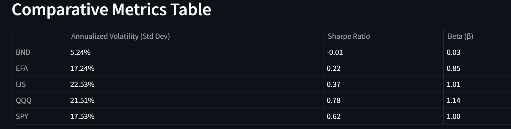

# 📈 Mutual Fund & ETF Portfolio Analyzer

This Streamlit application is an interactive tool for modern portfolio analysis, designed to help users build a well-balanced investment portfolio based on principles of Modern Portfolio Theory (MPT).

The project simulates the workflow of a financial data analyst, starting from data ingestion and cleaning, moving to exploratory risk & return analysis, and concluding with sophisticated portfolio optimization.

---

## ✨ Application Showcase

Below is a preview of the key analysis dashboards within the application.

### Comparative Risk & Return Analysis
The application provides a clear, formatted table comparing the core assets on key performance and risk metrics.



### The Efficient Frontier
Using a Monte Carlo simulation, the application plots the Efficient Frontier to visualize thousands of potential portfolios and identify the most optimal choices.


### Final Portfolio Recommendation
Based on the optimization, the application delivers a clear, client-ready recommendation, including the optimal asset allocation and its expected performance.

<table>
  <tr>
    <td></td>
    <td></td>
  </tr>
</table>

---

## 🚀 How to Run Locally

To run this application on your local machine, follow these steps:

1.  **Clone the repository (or ensure you have the project folder):**
    ```bash
    git clone 
    https://github.com/sankalp250/Mutual-Fund-Investment-Plan.git
    cd mutual_fund_portfolio_analyzer
    ```

2.  **Create and activate a Python virtual environment:**
    ```bash
    # For Windows
    python -m venv venv
    venv\Scripts\activate

    # For macOS/Linux
    python3 -m venv venv
    source venv/bin/activate
    ```

3.  **Install the required libraries:**
    ```bash
    pip install -r requirements.txt
    ```

4.  **Run the Streamlit application:**
    ```bash
    streamlit run app.py
    ```
    Your web browser will automatically open with the running application.

## 🛠️ Technologies Used

- **Language:** Python
- **Core Libraries:**
  - `Streamlit`: For building the interactive web application.
  - `Pandas`: For data manipulation and analysis.
  - `NumPy`: For numerical operations and the Monte Carlo simulation.
  - `yfinance`: For downloading financial data.
  - `Plotly`: For creating beautiful, interactive charts.